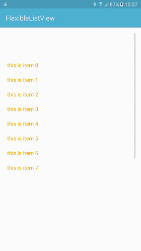
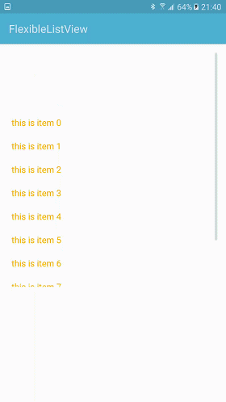

# flexiableListView
弹性listview，并且实现了上拉和下拉功能
<br>
## Feature
- 实现了弹性效果
- 实现了上拉和下拉功能
- 使用非常简单

## 用法
###1.首先在xml中定义好
```xml
<cn.appleye.flexiblelistview.FlexibleListView
        android:id="@+id/flexible_list_view"
        android:layout_width="match_parent"
        android:layout_height="wrap_content" />
```
###2.当需要上拉或者下拉功能时，在代码中实现监听接口
```java
mFlexibleListView = (FlexibleListView) findViewById(R.id.flexible_list_view);
mFlexibleListView.setOnPullListener(new FlexibleListView.OnPullListener(){

            @Override
            public void onPullDown() {
                //下拉刷新
            }

            @Override
            public void onPullUp() {
                //上拉加载更多
            }
        });
```
###demo



# About
@Author : Liu Liaopu </br>
@Website : https://github.com/newhope1106

# License
Copyright 2015-2016 Liu Liaopu

Licensed under the Apache License, Version 2.0 (the "License"); you may not use this file except in compliance with the License. You may obtain a copy of the License at

http://www.apache.org/licenses/LICENSE-2.0

Unless required by applicable law or agreed to in writing, software distributed under the License is distributed on an "AS IS" BASIS, WITHOUT WARRANTIES OR CONDITIONS OF ANY KIND, either express or implied. See the License for the specific language governing permissions and limitations under the License.
